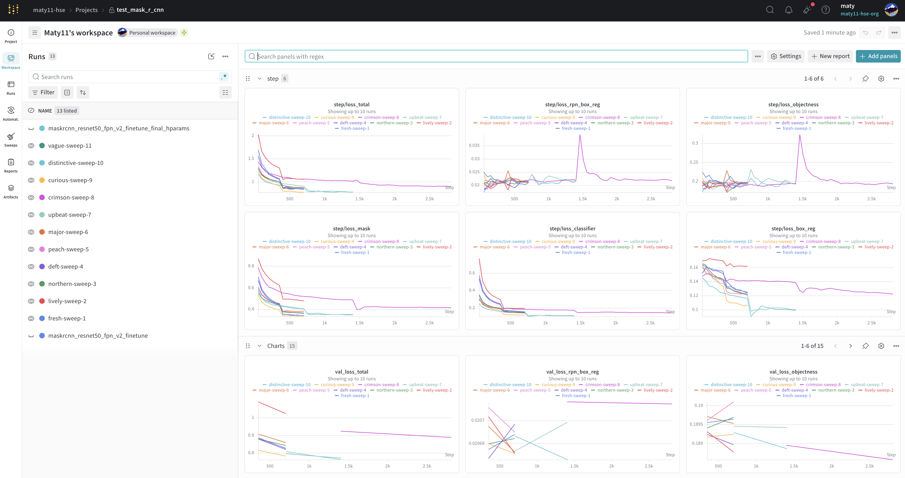

# Проекты W&B — сегментация повреждений авто (CarDD)

Ссылки на эксперименты по обучению трёх моделей instance-сегментации повреждений автомобилей на датасете CarDD.

- [insurance-driving-and-damage](https://wandb.ai/masksasha-hse-university/insurance-driving-and-damage/workspace) — воркспейс для всех запусков табличных данных
- [car_damage_yolov8](https://wandb.ai/maty11-hse/car_damage_yolov8) — **YOLOv8n-seg** (nano), обучение на CarDD. Запуски `final_yolo` + `trial_1…4`, графики метрик (mAP50 box/mask) и лоссов; веса лежат в артефакте `yolov8_results` (`best.pt`).
- [test_mask2former](https://wandb.ai/maty11-hse/test_mask2former) — **Mask2Former** (swin-tiny), дообучение на CarDD. Чекпойнт `mask2former_cardd_*.pt` в артефактах.
- [test_mask_r_cnn](https://wandb.ai/maty11-hse/test_mask_r_cnn) — **Mask R-CNN** (resnet50-fpn-v2), обучение на CarDD. Чекпойнт `maskrcnn_cardd_*.pt` в артефактах.

В каждой лежат логи выаолнения, метрики по эпохам, и **артефакты обученных моделей**.

При оценке качесва модели скачивалисб именно из `wandb`

  

